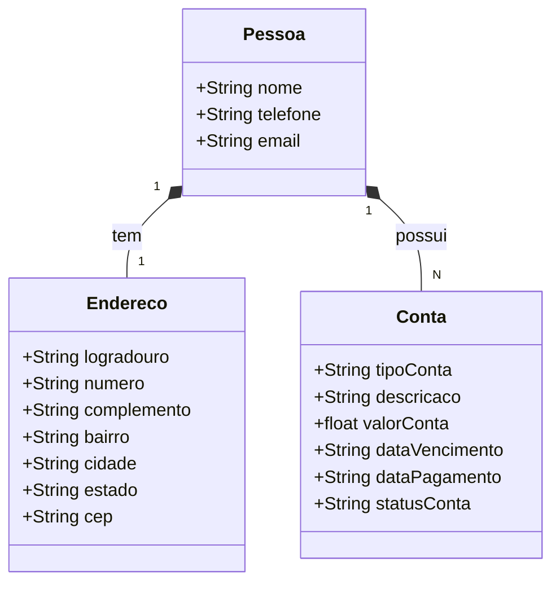

# 🖥️ API Gerenciador de Contas Residenciais - GerCon

## 📖 Descrição

O intuito do projeto é criar uma API de gerenciamento de contas residenciais,
onde o usuário poderá cadastrar contas de água, luz, telefone, internet, entre outras,
e visualizar um resumo das contas cadastradas.

## Tecnologias Utilizadas

## 🚀 Funcionalidades

- [x] Cadastro de Conta
- [x] Listar todas as contas
- [x] Buscar conta por ID
- [x] Deletar conta por ID
- [x] Atualizar conta

## Diagrama de Classes

## Open API - Swagger

- Link uso Local: http://localhost:8080/swagger-ui/index.html#/

