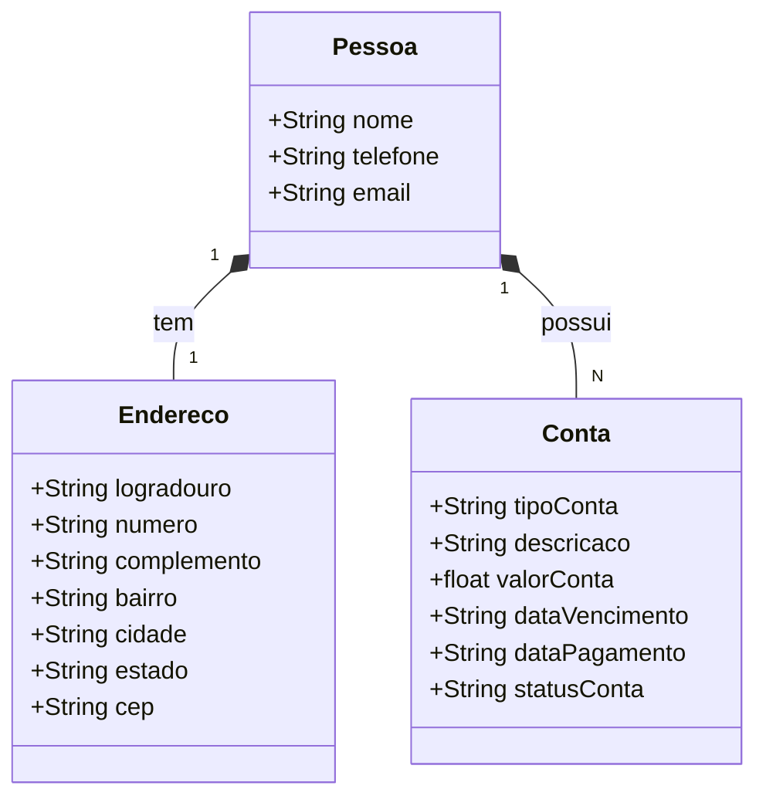

# 🖥️ API Gerenciador de Contas Residenciais - GerCon

## 📖 Descrição

O intuito do projeto é criar uma API de gerenciamento de contas residenciais,
onde o usuário poderá cadastrar contas de água, luz, telefone, internet, entre outras,
e visualizar um resumo das contas cadastradas.

| Tecnologias | Versão |
| ----------- | ------ |
| JAVA        | 17     |
| Spring Boot | 3.3.4  |
| Maven       | 3.8.4  |
| MySQL       | 8.0.27 |
| JUnit       | 5.8.2  |
| Swagger     | 3.0.0  |

## 🚀 Funcionalidades

- [x] Cadastro de Conta
- [x] Listar todas as contas
- [x] Buscar conta por ID
- [x] Deletar conta por ID
- [x] Atualizar conta
- [ ] Relatorio de Contas Pagas
- [ ] Relatorio de Contas Pendentes
- [ ] Relatorio de Contas Vencidas
- [ ] Relatorio de Contas a Pagar
- [ ] Alerta de Contas Vencidas
- [ ] Alerta de Contas a Vencer

## Testes dos Endpoints

## Diagrama de Classes

