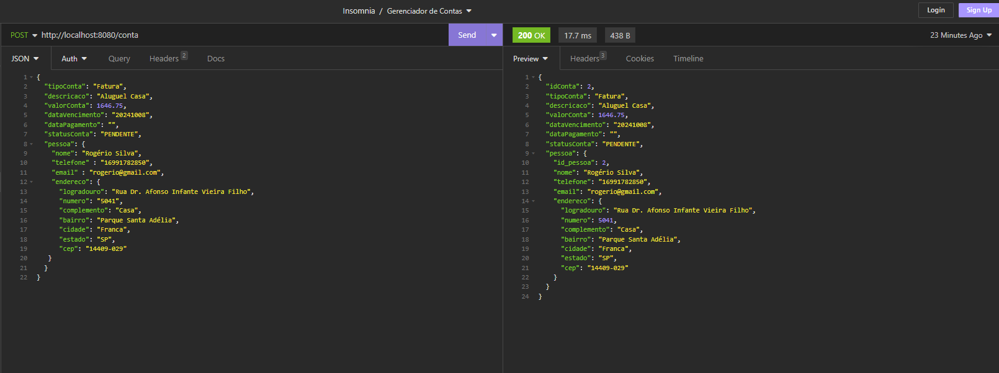
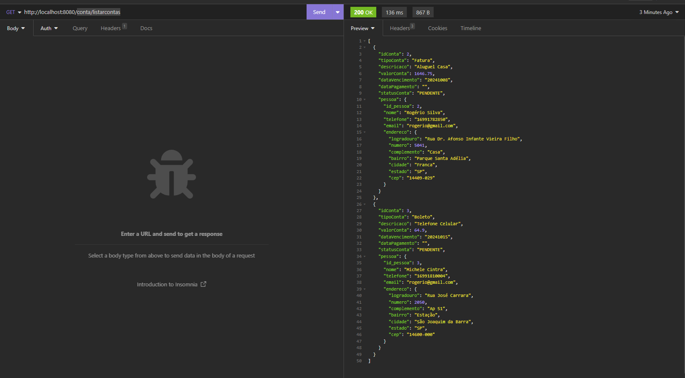
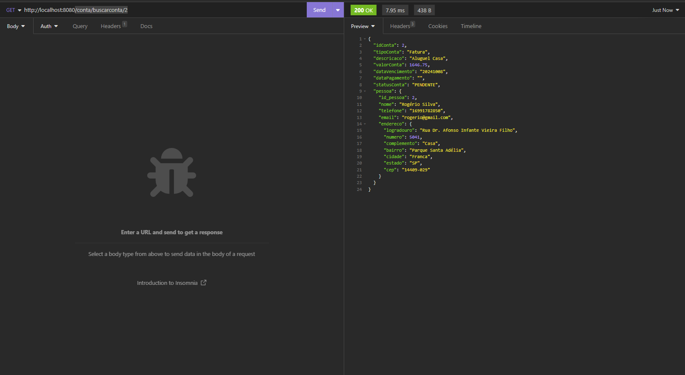
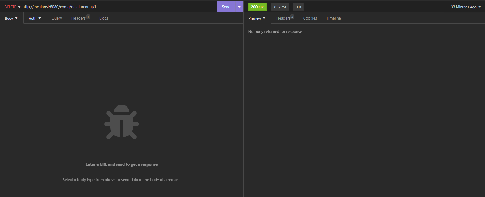
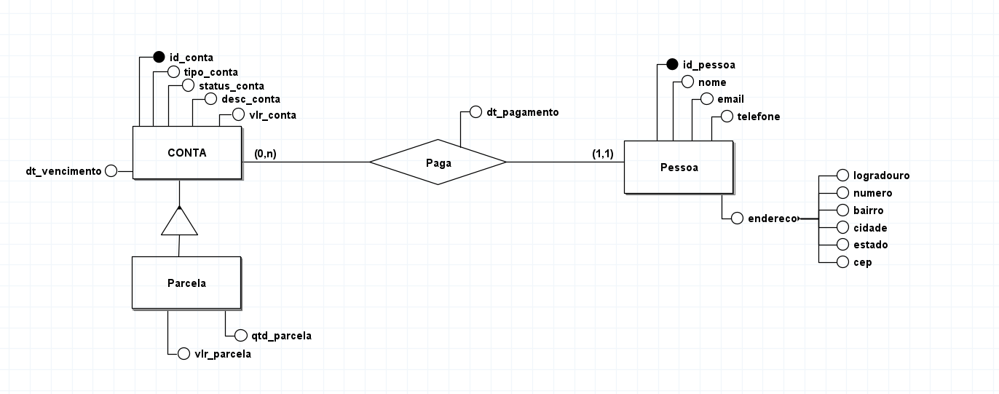
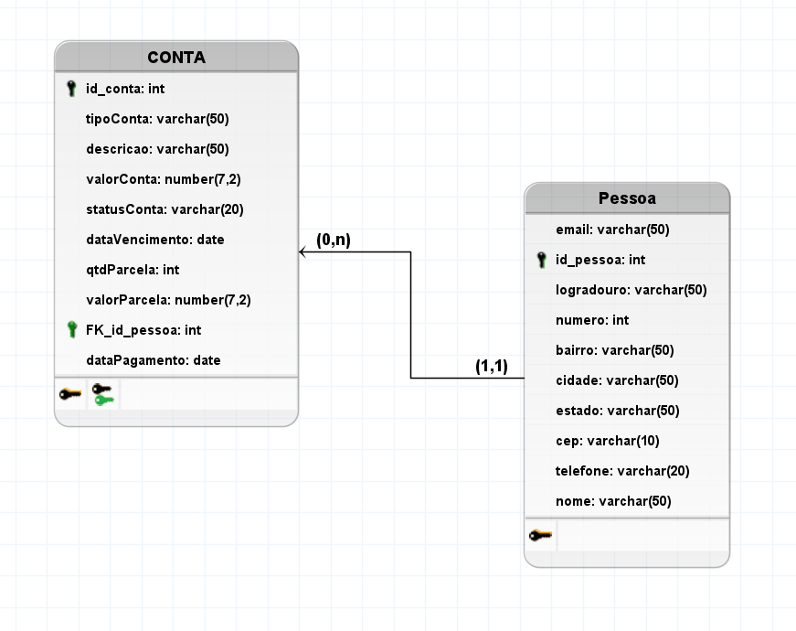

# 🖥️ API Gerenciador de Contas Residenciais - GerCon

## 📖 Descrição
O intuito do projeto é criar uma API de gerenciamento de contas residenciais, 
onde o usuário poderá cadastrar contas de água, luz, telefone, internet, entre outras, 
e visualizar um resumo das contas cadastradas.


| TECNOLOGIAS | Versão |
|-------------|--------|
| JAVA        | 17     |
| Spring Boot | 3.3.4  |
| Maven       | 3.8.4  |
| MySQL       | 8.0.27 |
| JUnit       | 5.8.2  |
| Swagger     | 3.0.0  |


## 🚀 Funcionalidades
- [x] Cadastro de Conta
- [x] Listar todas as contas
- [x] Buscar conta por ID
- [x] Deletar conta por ID
- [x] Atualizar conta
- [ ] Relatorio de Contas Pagas
- [ ] Relatorio de Contas Pendentes
- [ ] Relatorio de Contas Vencidas
- [ ] Relatorio de Contas a Pagar
- [ ] Alerta de Contas Vencidas
- [ ] Alerta de Contas a Vencer


## Testes dos Endpoints

### ✅ Cadastro de Conta (POST)

**Endpoint:** /conta 

```json
{
  "tipoConta": "Fatura",
  "descricaco": "Aluguel Casa",
  "valorConta": 1646.75,
  "dataVencimento": "20241008",
  "dataPagamento": "",
  "statusConta": "PENDENTE",
  "pessoa": {
    "nome": "Rogério Silva",
    "telefone" : "16991782850",
    "email" : "rogerio@gmail.com",
    "endereco": {
      "logradouro": "Rua Dr. Afonso Infante Vieira Filho",
      "numero": "5041",
      "complemento": "Casa",
      "bairro": "Parque Santa Adélia",
      "cidade": "Franca",
      "estado": "SP",
      "cep": "14409-029"
    }
  }
}
```
**Teste Realizado no Insominia**



### ✅ Listar todas as contas (GET)

**Endpoint:** /conta/listarcontas 

**Teste Realizado no Insominia**




### ✅ Buscar conta por ID (GET)

**Endpoint:** /conta/buscarconta/{id}

**Teste Realizado no Insominia**




### ✅ Deletar conta por ID (DELETE)

**Endpoint:** /conta/deletarconta/{id}

**Teste Realizado no Insominia**




### ❌ Atualizar conta (PUT) - Em Desenvolvimento


## 🎲 Modelagem do Banco de Dados

**Diagrama Entidade Relacionamento**




**Modelo Lógico**



**Script de Criação do Banco de Dados**

```sql

CREATE TABLE CONTA (
    id_conta int PRIMARY KEY,
    tipoConta varchar(50),
    descricao varchar(50),
    valorConta number(7,2),
    statusConta varchar(20),
    dataVencimento date,
    qtdParcela int,
    valorParcela number(7,2),
    FK_id_pessoa int,
    dataPagamento date
);

CREATE TABLE Pessoa (
    email varchar(50),
    id_pessoa int PRIMARY KEY,
    logradouro varchar(50),
    numero int,
    bairro varchar(50),
    cidade varchar(50),
    estado varchar(50),
    cep varchar(10),
    telefone varchar(20),
    nome varchar(50)
);
 
ALTER TABLE CONTA ADD CONSTRAINT FK_CONTA_2
    FOREIGN KEY (FK_id_pessoa)
    REFERENCES Pessoa (id_pessoa)
    ON DELETE CASCADE;

```
